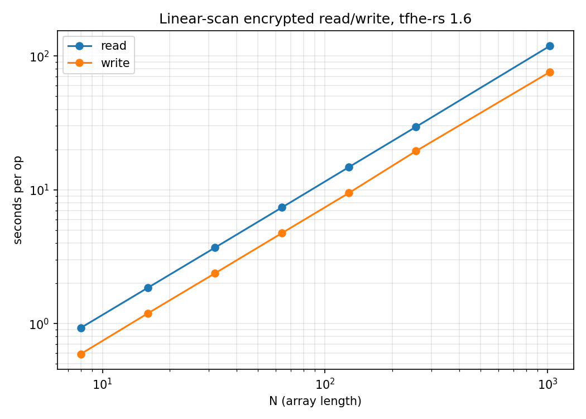

# fhe-memory-lab

Linear-scan encrypted-index RAM on [tfhe-rs](https://github.com/zama-ai/tfhe-rs):
read and write an array slot at an index the server never sees, because the
index is a ciphertext.

Both ops touch every slot on every call — `read` is
`Σ_j if_then_else(eq(enc_idx, j), arr[j], 0)`, `write` is the same scan with
the branches flipped — so each op costs O(N) programmable bootstraps and
leaks **zero** access pattern. That's the tradeoff: this is the slow,
maximally-private baseline every other encrypted-memory backend gets
compared against.



Measured on tfhe-rs 1.6, default parameters: ~116 ms per slot for read,
~74 ms per slot for write, cleanly linear from N=8 (0.93 s) to N=1024
(119 s). Numbers in [bench-results.csv](bench-results.csv).

## Run it

```sh
cargo test --release          # oracle tests: read + write vs. plaintext ground truth
cargo bench                   # criterion, N ∈ {8..1024} — regenerates bench-results.csv (slow: ~1 h)
python3 plot.py               # bench-results.csv -> bench.png
```

## Where this is going

Next: a blind-array-access (BAA) backend to beat the scan, and replay
resilience — making repeated writes safe against a rewinding evaluator, not
just correct on a single run.
